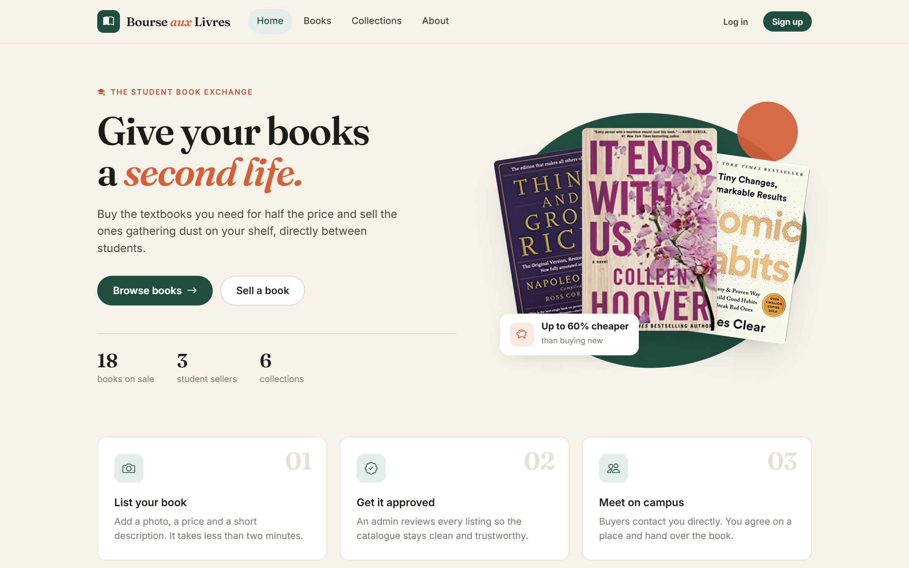
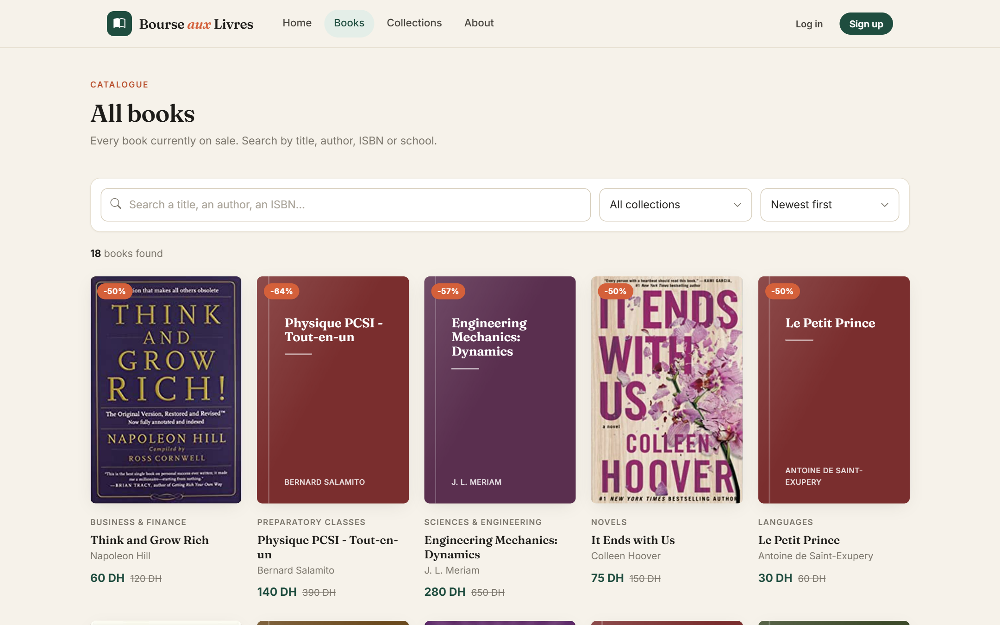
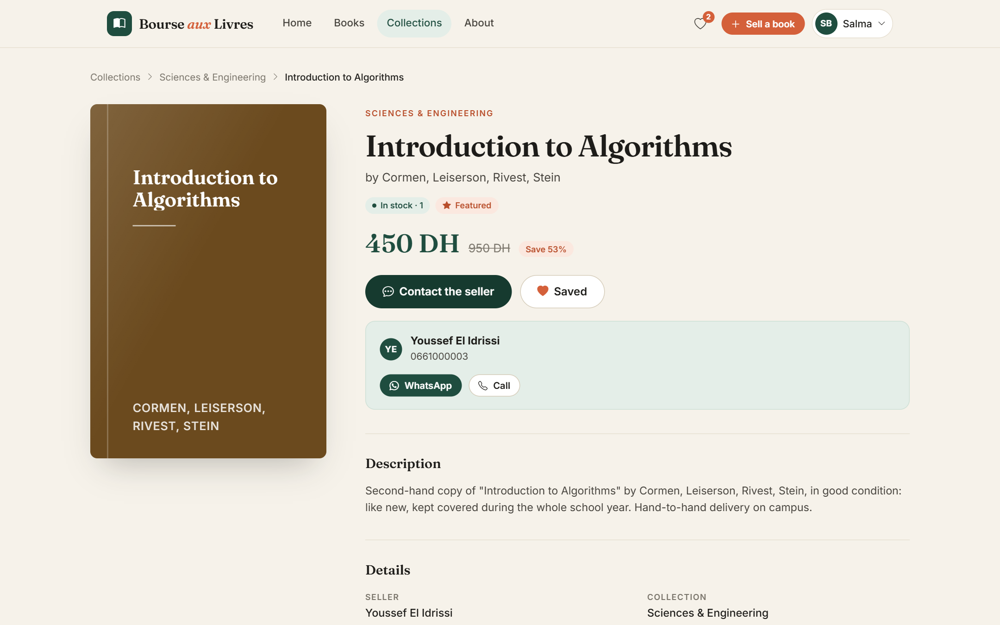
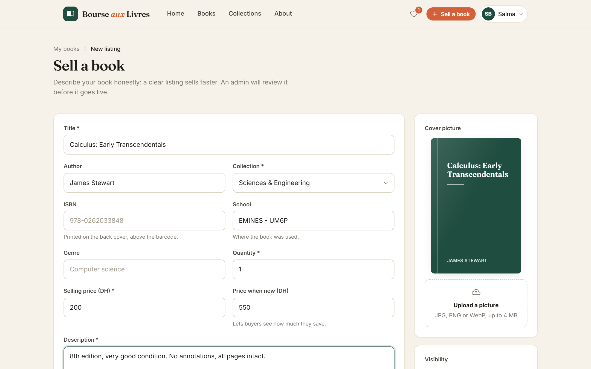
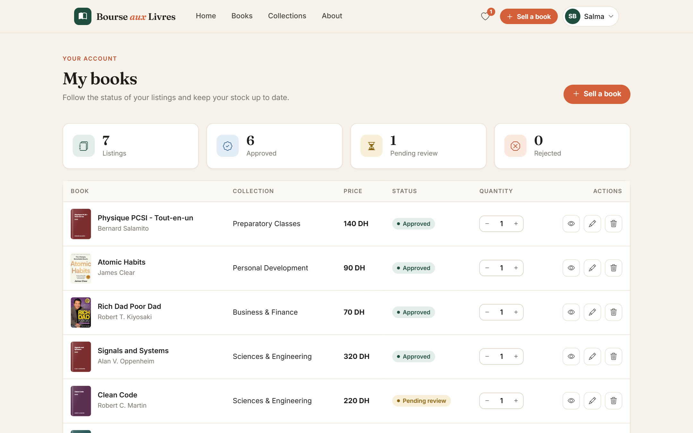
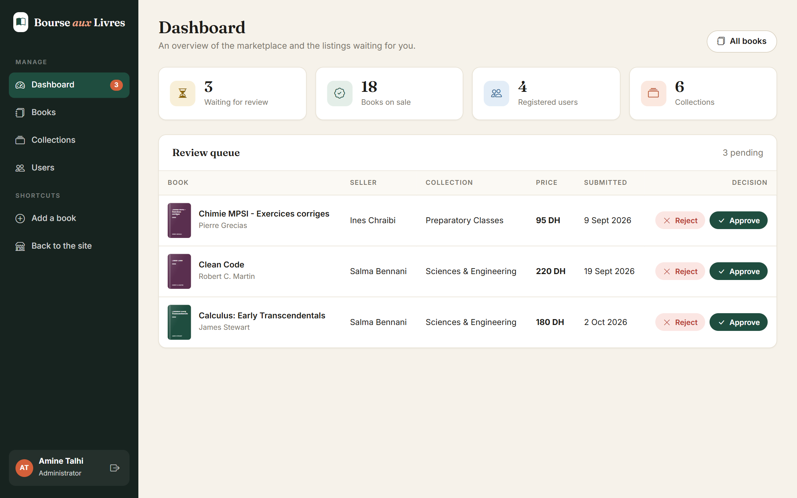
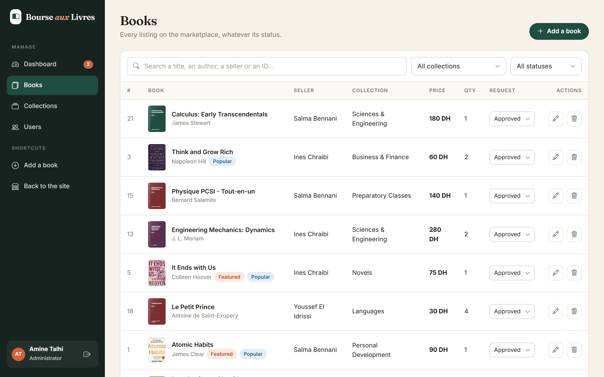
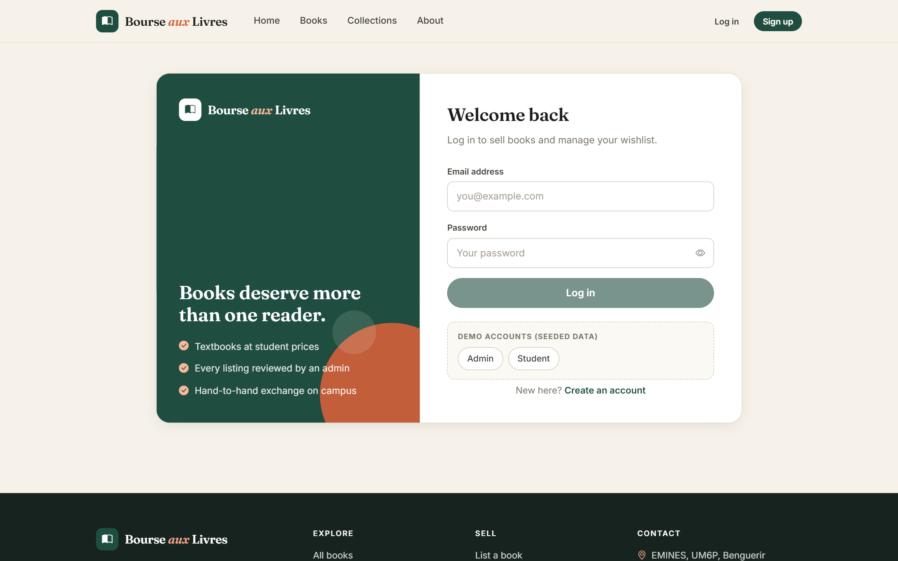

# Bourse aux Livres

A student book exchange: students list the second-hand textbooks and novels they no longer need, an administrator
reviews each listing, and buyers contact the seller directly to meet on campus.

The project is a **React** single-page application talking to a **Laravel** REST API secured with **JWT**.



## Features

**Visitors**

- Browse the catalogue, search by title, author, ISBN or school, filter by collection and sort by price or date
- Browse books by collection, see popular, featured and recently added books on the home page
- Responsive layout, from phones to large screens

**Students (logged in)**

- Sign up, log in, edit their profile and password
- List a book for sale with a cover picture; edit, hide or delete their own listings and keep the stock up to date
- Follow the status of each listing (pending review, approved, rejected)
- Save books to a wishlist and contact sellers by phone or WhatsApp

**Administrators**

- Dashboard with key figures and a review queue to approve or reject new listings
- Manage every book, feature books on the home page
- Create, edit, hide and delete collections
- Promote users to administrators

## Screenshots

| Catalogue | Book page |
| --- | --- |
|  |  |

| Sell a book | My books |
| --- | --- |
|  |  |

| Admin dashboard | Admin: books |
| --- | --- |
|  |  |

| Log in | Mobile |
| --- | --- |
|  |  |

More screenshots are available in [`docs/screenshots`](docs/screenshots).

## Tech stack

| Layer | Tools |
| --- | --- |
| Frontend | React 18, React Router 7, Axios, Vite, plain CSS design system, Bootstrap Icons |
| Backend | Laravel 12 (PHP 8.2+), Eloquent, JWT authentication (`tymon/jwt-auth`) |
| Database | MySQL (SQLite also works for local development) |
| Tests | PHPUnit feature tests for the API |

## Project structure

```
Bourse-aux-livres/
├── laravel/     REST API (routes/api.php, app/Http/Controllers, app/Models, database/)
├── Reactjs/     React application (src/pages, src/components, src/context, src/styles)
└── docs/        Screenshots
```

## Getting started

### Requirements

- PHP 8.2 or newer and [Composer](https://getcomposer.org)
- Node.js 20 or newer
- MySQL (or SQLite)

### 1. Backend (Laravel API)

```bash
cd laravel
composer install
cp .env.example .env
php artisan key:generate
php artisan jwt:secret
```

Create a MySQL database named `bourse_aux_livres` and check the `DB_*` values in `.env`
(to use SQLite instead, set `DB_CONNECTION=sqlite` and create an empty `database/database.sqlite` file).

```bash
php artisan migrate --seed
php artisan serve
```

The API is now running on http://localhost:8000.

### 2. Frontend (React)

```bash
cd Reactjs
npm install
cp .env.example .env
npm run dev
```

Open http://localhost:3000. The API URL can be changed with `VITE_API_URL` in `Reactjs/.env`.

### Demo accounts

`php artisan migrate --seed` creates a small catalogue and these accounts (password: `password`):

| Role | Email |
| --- | --- |
| Administrator | `admin@bourse.test` |
| Student | `salma@bourse.test` |
| Student | `youssef@bourse.test` |
| Student | `ines@bourse.test` |

## API overview

All routes are prefixed with `/api`. Protected routes expect an `Authorization: Bearer <token>` header.

| Method | Route | Access | Description |
| --- | --- | --- | --- |
| POST | `/register`, `/login` | Public | Create an account / get a token |
| GET | `/books`, `/books/highlights`, `/books/{id}` | Public | Catalogue, home page data, book details |
| GET | `/categories`, `/categories/{slug}/books` | Public | Collections and their books |
| GET, PUT | `/me` | User | Read / update the profile |
| POST | `/logout`, `/refresh` | User | Invalidate / refresh the token |
| GET | `/my/books` | User | Listings of the logged-in user |
| POST | `/books`, `/books/{id}` | User | Create / update a listing (owner or admin) |
| PATCH | `/books/{id}/quantity` | User | Update the stock (owner or admin) |
| DELETE | `/books/{id}` | User | Delete a listing (owner or admin) |
| GET, POST | `/wishlist` | User | Read / add to the wishlist |
| DELETE | `/wishlist/{bookId}` | User | Remove from the wishlist |
| GET | `/admin/stats`, `/admin/books`, `/admin/users` | Admin | Dashboard data |
| PATCH | `/admin/books/{id}/request` | Admin | Approve or reject a listing |
| GET, POST, PUT, DELETE | `/admin/categories` | Admin | Manage collections |
| PUT | `/admin/users/{id}/role` | Admin | Change a user's role |

## Tests

```bash
cd laravel
php artisan test
```

The feature tests cover authentication, validation, the review workflow, ownership rules, admin-only routes and the
wishlist. They run on an in-memory SQLite database.

## Author

Mohammed Amine TALHI - EMINES, School of Industrial Management (UM6P).
